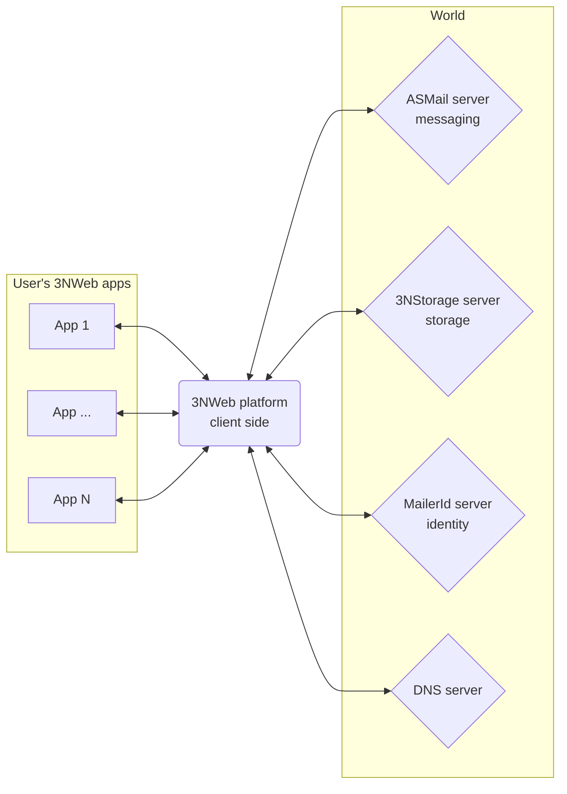

#  Client-side 3NWeb platform

This repository contains client-side 3NWeb platform.
Platform's core talks 3NWeb protocols with servers, does all of crypto, keeps all user's keys, and provides an easy-to-use API for apps that run in 3NWeb platform.

This is a desktop implementation of 3NWeb platform, and it uses [Electron](https://www.electronjs.org/).
Platform's core runs as a main process, while apps run in renderer processes.



( [docs folder](./docs/platform.md) ).


## Platform setup notes

To use this repo, you need [Node.js](https://nodejs.org/), minimum version 24.x.

Native modules are written in [Rust](https://rust-lang.org/), and use [NAPI-RS](https://napi.rs/).

Cross compilation uses `--cross-compile` [flag](https://napi.rs/docs/cli/build#options) requiring presence of [zig](https://ziglang.org/). `rustup` targets should be added for cross-compilation.

### Linux

The following kitchen sink is apt-ed in Ubuntu, besides node and deno:
```
apt-get install -y make gcc gcc-multilib g++ g++-multilib pkg-config build-essential libfuse-dev fuse
```

### Windows

Install:
- node, minimum version 24.x. In GUI installer check option that installs chocolatery with the whole kitchen sink that also pulls in Visual Studio libraries.
- git with included MINGW that has bash and other things for reuse of scripts on Windows.
- deno should be placed into `bin` folder in `Git` installation. Then bash from MINGW will see it.
- [Dokany](https://github.com/dokan-dev/dokany) to give FUSE on Windows. Ensure to check installation of files for development, else C headers won't be available.

Ensure that bash is accessible in path. Adding something like `C:\Program Files\Git\bin` to `PATH` environment variable will help. Adjust path in admin console with `setx path /M ...`, else you may have repeating entries, coupled with hard 1024 char limit.


### Mac

[fuser based napi module](https://www.npmjs.com/package/napi-fuser) needs [macfuse](https://macfuse.github.io/) that comes M-based macs with [addition config](https://github.com/macfuse/macfuse/wiki/Getting-Started#enabling-support-for-third-party-kernel-extensions-apple-silicon-macs).


## Usage

First run
```
npm ci
```
that will restore packages in accordance to package-lock, including development tools like TypeScript.
Some post-install scripts are also present, beware on updates of dependencies and just rely on pair of remove-all and npm-ci.

Use npm scripts:
```
npm run
```
will show different available tasks.

When you update/change any npm dependencies, remove `node_modules` and run `npm ci` to have clean setup. Otherwise you may get non-obvious errors. For installation use `packing/npm-install.sh` that does all aforementioned steps.

Compilation from ground up and testing should be:
```
npm ci
npm run compile all
npm run tests
```

`ts-code` is a main platform source folder. Yet, it has folders into which more code gets copied/generated before platform's main compilation can run. These are `protos` folder with JS+TS generated from proto files. `all` option in `compile` task orders these prepping tasks, but they can also be run individually.

Build after successful compile requires you to provide system 3NWeb apps for complete wrapping. And with system apps, the following should build:
```
npm run build
```


## Implementation notes

### IPC between core and web-gui (main and renderer processes)

Renderer process uses isolated worlds. IPC uses weak references to detect object drop and signal it over to the other side. But, weak references don't cross with isolation boundary. Which means that all proxy object creation must happen in main world/context. This is done by loading `/setup-w3n.bundle.js` script, that is provided by platform on this url path value. Startup app uses `/setup-w3n-for-startup.bundle.js` script.


# License

Code is provided here under GNU General Public License, version 3.

All API's, available to apps that run in 3NWeb platform, are free for anyone to use, to implement, to do anything with them.
We specifically *do not* subscribe to USA's court's concept that API is copyrightable.
